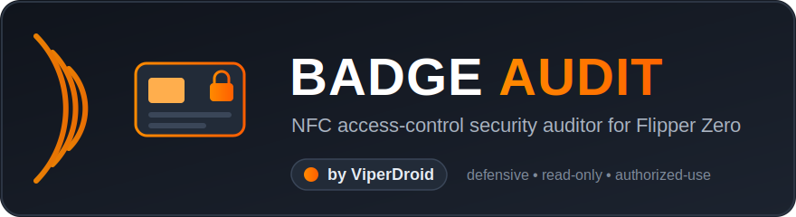
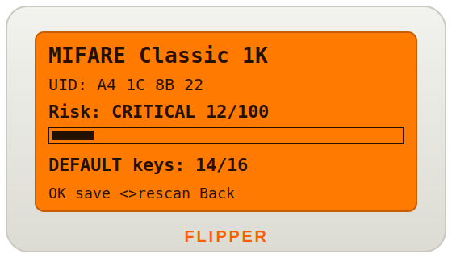

<p align="center">
  
</p>

<p align="center">
  
  
  
  
  
  
</p>

> **Audit the badge, not break into the door.** Badge Audit is a *defensive* Flipper Zero app that tells you how secure an NFC access credential actually is — it identifies the chip, reads the UID, tests MIFARE Classic for factory/default keys, and gives you a clone‑resistance score you can act on.

Almost every Flipper NFC tool exists to **read, clone, or emulate** a card. Badge Audit does the opposite: it **assesses** one. Point it at your office/apartment/gym badge and find out — in seconds — whether that credential is wide open or genuinely protected.

<p align="center">
  
</p>

---

## ✨ Features

- 🔍 **Protocol identification** — detects the real card type (MIFARE Classic / Ultralight / DESFire / Plus, ISO14443‑3A/4A/B, ISO15693, FeliCa, ST25TB, …).
- 🆔 **UID / SAK / ATQA readout** — shows the live identifiers read from the card.
- 🔑 **MIFARE Classic default‑key test** — tries the common factory keys against **every sector** and reports how many are still unprotected. This is the #1 real‑world access‑control weakness.
- 📊 **Clone‑resistance score (0–100)** + WEAK / MEDIUM / STRONG / **CRITICAL** verdict with a visual bar.
- 💾 **Scorecard export** — append a human‑readable posture report to the SD card for your notes / engagement evidence.
- ♻️ **Rescan** without leaving the app.

## 🎮 Controls

| Button | Action |
| :----- | :----- |
| *(tap card to back)* | Detect & analyze the badge |
| **OK** | Save the scorecard to SD |
| **◀ ▶ ▲ ▼** | Rescan a new card |
| **Back** | Exit |

## 🧮 How posture is scored

| Card / protocol | Verdict | Why |
| :-- | :-- | :-- |
| MIFARE Classic **with default keys** | 🔴 CRITICAL | Sectors open with factory keys — effectively unprotected |
| MIFARE Classic (no default keys) | 🟠 WEAK | Crypto1 is broken; keys are recoverable & card is cloneable |
| ISO14443‑3A/B (UID only), Ultralight, ISO15693, ST25TB | 🟠 WEAK | If the reader trusts the UID, the badge is trivially cloneable |
| ISO14443‑4A/4B, FeliCa | 🟡 MEDIUM | Security depends on the application layer |
| MIFARE Plus (SL3), DESFire EV1/2/3 | 🟢 STRONG | AES/3DES mutual authentication |

## 🛠️ Build & install

Built with the official **[ufbt](https://github.com/flipperdevices/flipperzero-ufbt)** toolchain.

```bash
# 1. Install ufbt (once)
python3 -m pipx install ufbt

# 2. Clone & build
git clone https://github.com/ViperDroid/flipper-badge-audit.git
cd flipper-badge-audit
ufbt                      # produces dist/badge_audit.fap

# 3. With the Flipper plugged in via USB (close qFlipper first):
ufbt launch               # builds, uploads, and runs it on the device
```

**No toolchain?** Grab `badge_audit.fap` from the [Releases](https://github.com/ViperDroid/flipper-badge-audit/releases) page and copy it to your SD card under `apps/NFC/` with qFlipper. It then appears on the device at **Apps → NFC → Badge Audit**.

## 📄 Scorecard sample

`OK` appends a report like this to the SD card:

```
=== Badge Audit ===
Card: MIFARE Classic 1K
UID: A4 1C 8B 22
SAK: 08  ATQA: 00 04
Risk: CRITICAL (12/100)
Default-key sectors: 14/16
Note: Sectors authenticating with factory keys are unprotected; rekey or migrate to DESFire.
-------------------
```

## 🗺️ Roadmap

- [ ] Show **which** default key opened each sector
- [ ] 125 kHz LF badge support (EM4100 / HID Prox)
- [ ] CSV export for multi‑door site audits
- [ ] Reader‑side "grade the door" mode (Wiegand)

## ⚠️ Disclaimer

Badge Audit is a **read‑only, defensive** assessment tool. It does **not** clone, emulate, write, or bypass anything. Use it **only** on credentials and systems you own or have **explicit written authorization** to assess. You are responsible for complying with all applicable laws. Provided **as‑is**, without warranty of any kind.

## 📜 License

[MIT](LICENSE) © **ViperDroid** (Zakariya Jabbar)

---

<p align="center"><sub>Made with 🐬 + ☕ by <b>ViperDroid</b></sub></p>
